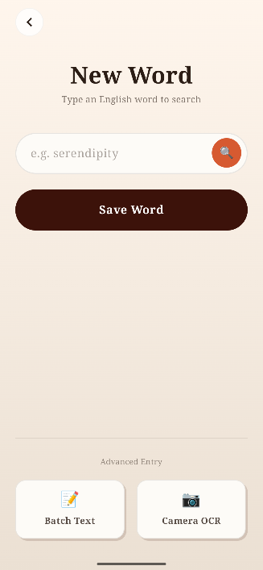
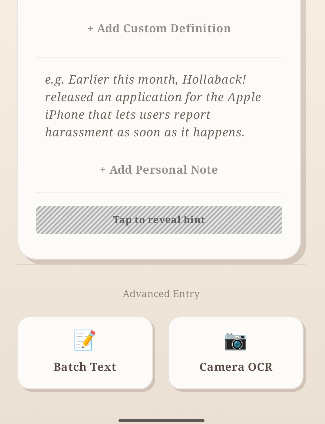
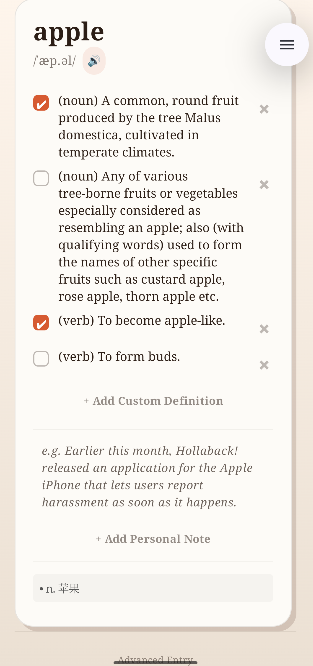
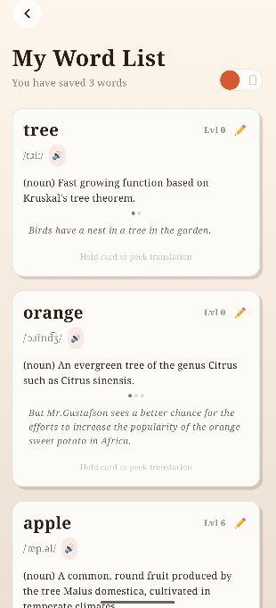
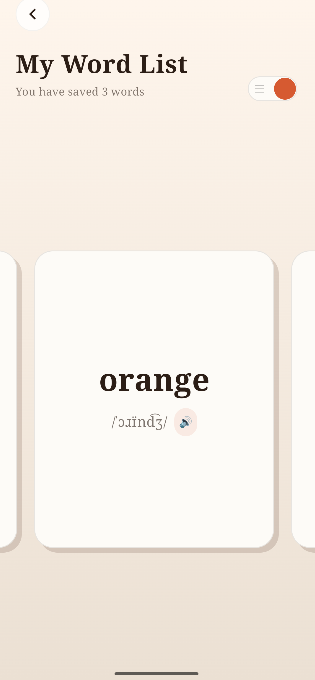
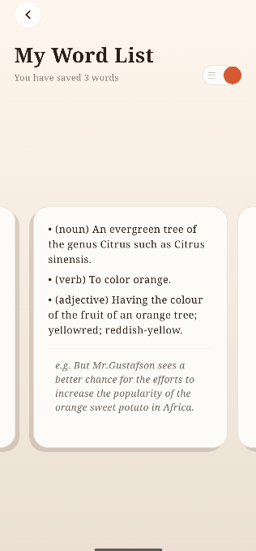
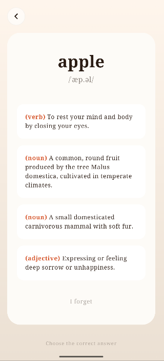
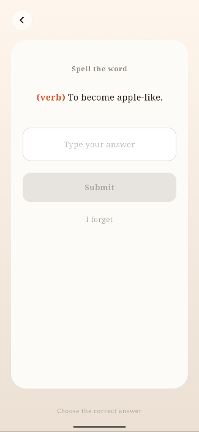

# MinimalistNotebook

文科生使用ai辅助独立开发的一款本地开源英语学习Android APP，一款致力于帮助用户建立全英文学习习惯、用户数据完全本地化运行的英语学习工具。第一次vibe开发应用，如有bug实属正常，请见谅，欢迎各位大佬提出宝贵意见，助力应用优化升级。

---

## 核心功能介绍

### 1. 仪表盘 (Dashboard) - 应用首页
应用开屏后进入的页面，直观展示当前的学习概况：
* **核心数据**：清晰显示你的总词汇量以及当前待复习的单词数。
* **简洁设计**：通过底部导航栏，可以快速切换到复习页或单词本。

### 2. 添加单词页 (Add Word)
点击首页的“+”号按钮即可进入。应用提供了灵活的录入方式，满足不同场景需求：
* **智能检索**：输入单词后自动联网抓取英文释义与例句，建立全英文语境。同时，单词的释义和例句支持自由修改，同一单词支持保留多个释义。

 
* **批量录入**：支持“Batch Text”（文本批量）和“Camera OCR”（拍照识别），大幅提升录入效率。
* **隐藏式中文辅助**：在界面下方提供一个灰色“刮刮乐”区域，存储中文解释。只有当你无法理解英文释义时，才建议点击查看。

   

### 3. 单词本 (My Word List)
点击底部小字进入，支持多种管理模式：
* **列表模式**：便捷查看、编辑和修改每一个单词的释义及笔记。
* **卡片模式**：点击右上角切换开关进入。通过滑动卡片进行快速回顾，点击即可翻面查看详细的英文释义与例句。

  

### 4. 复习页 (Review)
完成单词录入后，点击“Start Review”进入核心复习流程：
* **艾宾浩斯记忆法**：系统根据遗忘曲线自动规划 Lv1~Lv9 的复习路线。
* **多样化题型**：前期采用选择题模式测试基础识别，后期进阶为单词拼写或例句填空，从认读到拼写，深度掌握。
* **长期保持**：当单词达到 Lv9 等级后，系统会周期性以选择题形式呈现，彻底告别“背了就忘”。

 

---

## 💡 提醒功能使用建议
应用提醒功能设计的初衷是通过弹窗通知提醒，但由于应用数据是在本地运行，没有云端发送通知信息的能力，导致一关后台就无法发通知。
因此，现在的提醒功能是常驻状态，通过状态栏查看是否有待复习单词。如果想保证复习自动提醒功能正常使用，请在手机设置中为本应用：
1. **开启“自启动”权限**。
2. **将电池省电策略设置为无限制**。

如不想被打扰也可以关闭通知功能，减少打扰。
